**本文档是在官方文档基础上翻译得到的，包含了完整的运动捕捉的操作过程，但不包括其他高阶部分，如有需要请参照原文文档**
# 一、完成系统的初始化
确保硬件条件已经满足（详见硬件连接文档）：
1. 所有的硬件（相机、交换机，以及其他的第三方硬件如表面肌电装置、测力板等）都已经激活并连接完好。
2. 主机上的以太网口的IP地址已经被设置为192.168.10.1。
## (1) 在Nexus里配置硬件
第一次使用Nexus时，你必须配置好需要用的硬件（红外相机、彩色相机、测力板、EMG等）。在这次配置好之后，只有在你想要换一个系统配置的时候你才需要重新配置。

启动Nexus之后，软件自动检测已连接的所有硬件并把它们分好组，你可以在Resources面板下的System区域查看所有的硬件并对它们进行配置。

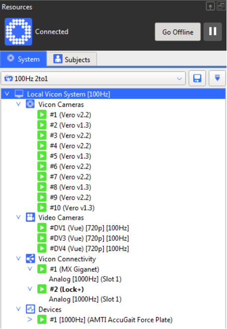

如果你保存了系统配置(.system文件)，在改变Local Vicon System 设置之前，确保想要的配置在System Resources面板里被选中。

开始配置：

1. 如果Nexus处于offline状态，点击Resources面板中的Go Live
2. 在System框中，选中Local Vicon System节点
3. 在Properties面板中，查看或改变设置。请确保Requested Frame Rate适合你的应用场景。

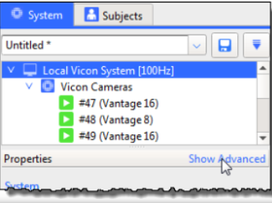

配置好你想要的属性之后，在System框的顶部，点击保存按钮以保存你的设置到一个.system文件里。

## (2) 以数据捕获为目的的配置Vicon红外相机
首先确保：

- 相机的焦距、光圈都已经调好
- 需要的系统配置已经被选中
- calibration device已经准备好
- 拿出一些标记点，用来划出测试区域

开始配置、校准相机：

1.  确保Nexus在Live模式中
2.  在视图选项中，选中Camera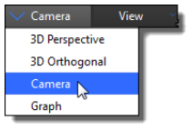 
3.  在System Resources树状图中，选中你想要配置的相机，被选中的相机被蓝色高亮。
4.  站在被捕捉的空间区域里，挥舞校准棒，确保各个相机视角里都能看到标记点（最好是处于中间位置）。
5.  在System 栏的properties页，点击是show advanced，显示额外的属性。
    
当你第一次设置Vicon的时候，按照以下顺序配置相机的属性：

    - Name
    - Strobe Intensity
    - Gain
    - Grayscale Mode
    - Threshold
    - Minimum Circularity Ratio
    - Enable Centroid Tracking
    - Marker Velocity
6. 确保Grayscale Mode 处于Auto
7. 保存
   
## (3) 配置彩色摄像头
1. 确认Nexus处于Live模式
2. 在System Resources面板中，选择你要配置的摄像头
    - 当你在配置Vicon 的彩色摄像头的时候，必须要先指定其IP地址（192.168.10.2）
    
3. 按照以下顺序进行配置
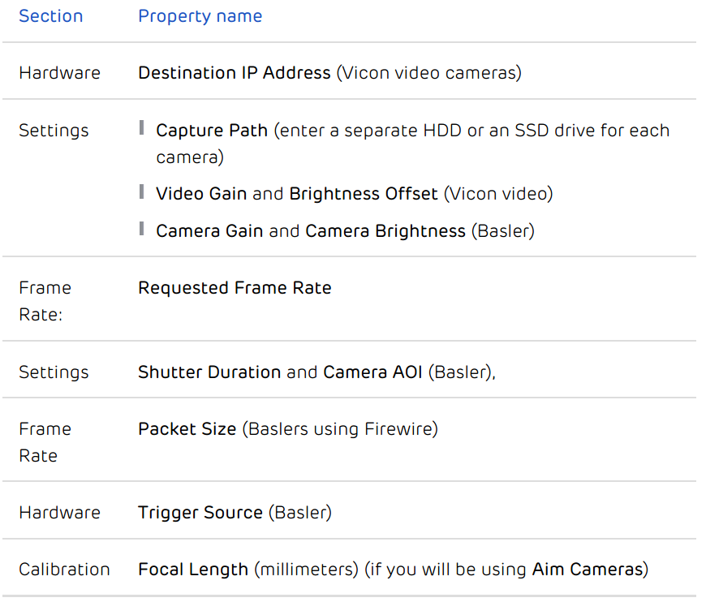
4. 保存配置
 
## (4) 对准摄像头
**在开始之前，选择3D Perspective展示模式。** 将摄像头对准采集区域，确保采集区域大概处于摄像头取像区域的中部。
**对于红外摄像头，使用标记点。对于彩色摄像头，使用标定架。**
1. Go Live
2. Options-> General View->选中Target Volume.
3. 在对话框的右侧，更新你的目标区域(Target Volume)的属性以使其反映你采集区域的大小。
4. 查看Vicon 相机的反馈

    - 选择Camera视角
    - 在View 下拉框中，选中3D overlay
    - 在System Resources栏中选中要对准的相机
5. 在System Preparation Tools面板中，展开Set Volume Origin区，在L-Frame下拉菜单中，选中5 Marker Wand&L-Frame.
6. 在采集区域里，放置标定物体在采集区域的中心。点击Aim Cameras中的Start.
7. 在System Resources栏中选中要对准的相机，保证能看到标定物体
8. 移动摄像头，使它的视角能覆盖采集区域
9. 对每个相机重复第7-8步，直到它们都被正确地对准

## (5) Mask unwanted reflections(掩盖多余的反射) 
Mask是指让Vicon摄像头忽视那些被环境产生的噪声（非标记点反射的光线）。
### 自动创建camera mask
1. 移除环境里所有不必要的物体。**尤其注意不能摆放标记点** ，否则这些标记点在之后的数据采集过程中将被相机忽略。
2. Go Live
3. 在System Resources表选中所有的红外相机
4. 选择Camera展示模式，以展示红外相机拍到的二维图像
5. 在View列表内，取消勾选3D overlay 和 Combined
   
   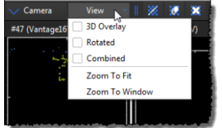
6. 在Options（按下F7)框中，General View Options中选中Threshold Map.
7. 根据“以数据捕获为目的的配置Vicon相机”里的描述的步骤调节相机设置。
8. 在System Preparation Tools 面板中，点击Mask Cameras区域中的Start
9. 大概30秒左右后，可以看到相机视角里的反射都被一些蓝色的方格掩盖了，如果没有剩下未被掩盖的反射（绿色），那么就可以点击结束按钮(stop)，如果还有留下的反射没有被自动掩盖，那么就要手动进行。

### 手动创建camera masks
第1-6步与自动进行camera mask时是一样的。

7. 选中某个相机，使用图中右侧的三个选项创建mask，从左到右分别是创建、消除、全部消除。
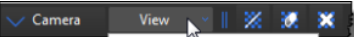

## (6) 进行相机标定
使用标定架进行标定，在每次进行实验前都进行一次标定，有助于减少误差。
1. 进行上述的对准和掩盖操作
2. 拿走采集区域里所有的产生红外反射的物体
3. Go Live
4. 选择Camera视图
5. 在System Resources中选中所有的摄像头
6. 在System Preparation Tools中展开Calibrate Cameras，然后从Wand中选中使用的标定架
7. 如果需要标定彩色相机，那么还要在Video Calibration Setup区中，点击Activate以开始彩色摄像头标定。保存配置
8. 在Calibrate Cameras 区，根据需求改变以下设置：(一般情况下不需要更改)
    - Calibration Type：Full Calibration or Calibration Refinement
    - 如果你想在标定完成后让系统自动停止，那么就勾选Auto Stop
9. 在Calibrate Cameras 区，点击Start.
10. 在采集区域里，挥动标定架。挥舞时的要点：
    - 保证各个摄像头都能同时看到标定架
    - 让标定架的运动遍布整个三维空间（视图里的彩色线条代表了标定架的运动轨迹）
    - 两个摄像头完成标定之间的时间间隔最好不超过5秒，越长误差越大。（Camera视图中特定摄像头右下角的三角区域有红色慢慢变为绿色，最后消失，表明了该摄像头标定过程的完成度）
11. 如果没有勾选Auto Stop则自己点击Stop，勾选了Auto Stop时，系统会在采集到足够数据后自行停止
12. 在Camera Calibration Feedback区中，监视进度，并查看Wand Count和Image Error等数据。
13. 如果标定了彩色摄像头，记得点击Video Calibration Setup中的Deactivate

## (7) 设置原点
1. 移除所有标记点和不需要的反射
2. Go Live
3. 选择3D Perspective视图
4. 在System Preparation Tools 面板中，展开Set Volume Origin区，选择使用的标定架（和之前的步骤中使用的是一样的）。如果实际操作中无法在原点位置放置标定架，那么你也可以选择One Marker或者Three Marker选项。
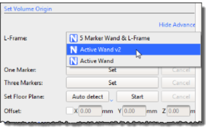
5. 在你想要的位置放置好标定架，并摆好朝向。
6. 点击Set Volume Origin 区中的Start，再点击Set Origin.原点和坐标轴被根据标定架的姿态自动选取。

## (8) 准备数据存放的位置
我们需要创建一个文件夹才能进行运动捕捉以及后续处理，这要通过Communications面板里的Data Management栏完成。
1. 点击Communications面板里的Data Management栏
2. 在工具栏中点击Show main proEclipse menu按钮
3. 点击Manage Eclipse Databases，在对话框中，点击Add New，创建一个新的数据库文件夹。
   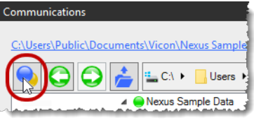
   `数据库只是一个存放你的Nexus文件的文件夹结构`
4. 为你的数据库选择一个存放位置
5. 创建一个层次结构以存放数据，推荐将具体的测试数据都放进session文件夹：
    1. 点击图标（New Pacient Classification)，通常，这会分出几组被测试者（如男性/女性，年老/年轻）
    2. 点击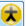（New Pacient)，属于某个测试者的数据都存放到这里面
    3. 点击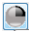（New Session)，某个测试者在某次测试中的数据存放在这里面
6. 点击一个Session以选中它。
现在你有了一个激活的Session，已经可以存放你的捕捉数据了。

# 二、进行运动捕捉
我们使用Vicon提供的Plugin Gait Model 进行人体运动捕捉。
- VST是指Vicon labeling skeleton tamplate 
- VSK是指Vicon labeling skeleton，是从VST创建的，包含了当前受试者具体信息。
## （1） 从模板创建一个新的Subject
你必须新建一个Subject，才能标定你的标记骨架。
1. 进行之前描述的准备工作（相机标定、数据库创建等）
2. 在Subjects Resources 面板，从已有的模型中新建一个Subject.
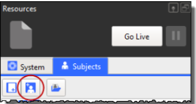
3. 选择需要的.vst 文件（Vicon skeleton template)
4. 在Enter Subject Name对话框内为你的Subject指定名称
5. 在新建的Subject的Properties面板中，填入所需要用到的各种参数。**用橙色高亮出来的部分是需要你填写的，可选的参数没有被高亮**
6. 右键点击Subject的名字然后点击保存
7. 按照Plugin Gait Model在受试者身上粘贴好标记点。(详见 [*Plugin-gait-model的文档*](./Plugin-gait-model.md))

## （2） 校准labeling skeleton
校准Vicon labeling skeleton(VSK)让Nexus能够识别出Subject并且自动决定哪些标记属于它的重构。（Calibrating a Vicon labeling skeleton (VSK) enables Nexus to recognize the subject and automatically determine which labels belong to its reconstructions.）
我们捕捉一小段数据用于校准，校准过程将包含在VST（模板）中的通用信息应用于具体的对象（subject）--也就是那个贴着标记点的受试者上。校准完成后，便保存了一个包含了受试者具体信息的VSK文件。该文件可以在整个捕捉过程中自动标记。**在受试者改变或者重新粘贴标记点时都要重新校准。** 

Nexus提供了多种校准的方式，推荐使用ROM trial 和 dynamic calibration，这样得到的结果最精确。

### 使用ROM试样进行初始校准
1. 确保你已经有运行模型所需要的各个参数：对于Plug-in Gait Lower Body模型来说，参数包括体重、身高、左腿长、右腿长（腿长定义为髂前上棘到内踝的长度）、左右膝宽、左右踝宽。(详见 [*Plugin-gait-model的文档*](./Plugin-gait-model.md))
2. 在Communications pane中，Data Management标签中，确保已经创建并打开了保存数据所需的数据库（即已经创建了New Pacient 和 New Session)，并且正确的Session已经处于激活状态（双击）。
3. 确认Nexus处于Live 状态。
4. 在System Resources 树目录下，选中Local Vicon System > General > Properties，检查Processing Level，选择好需要进行的实时处理，如果你不确定要选什么，那么至少也要选择Labels.
5. 选择3D Perspective 视角
6. 在新建的Subject的Properties面板中，填入所需要用到的各种参数。**用橙色高亮出来的部分是需要你填写的，可选的参数没有被高亮**
7. 在Subject Preparation Tools面板中，确认创建的subject被选中
8. 让受试者以基准姿势静止站立，如果你使用的是PiG model，则按照第11步描述的那样做。
    > 选择Subject Viewer视图，展示出来的便是目前所有VST的基准姿势 
    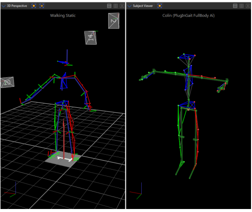
9.  确认所有的标记点都可见：数一数Subjects Resources树中Markers节点中标记点的数目，确认和3D perspective 视图中可见的数目是一样的。
10. 在Capture Tools面板中，Capture区，点击Start
11. 捕捉一个ROM测试数据：
   - 前1-3秒，受试者以”摩托车姿势“静止站立，如图所示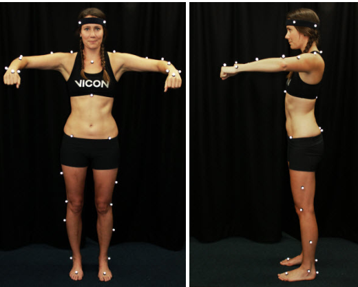
   - 之后，让受试者充分对身体各个关节进行运动。
12. 当有了足够的数据之后，点击Stop。
13. 点击重构测试数据
14. 在工具条上或者Pipeline Tools面板中，运行提供的Auto Initialize Labeling流程（你也可以自己标记）
    
    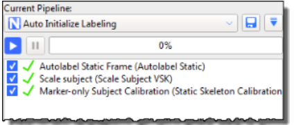
15. **按下CTRL+S或者点击保存按钮以保存测试以及VSK。**

### 评估并完成校准
1. 初始校准完成之后，查看测试，确保所有的标记点都可见并且每个点都被线连接，身体左侧的点都标记为红色，右侧的点标记为绿色。还可以在Quality界面中查看更多数据。

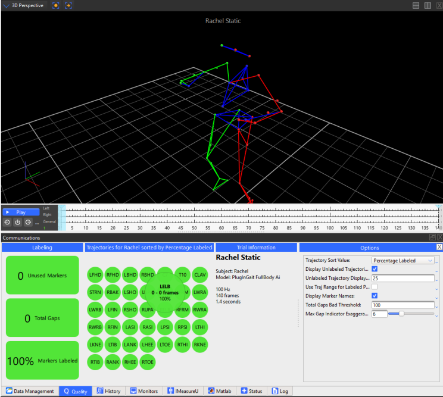

2. 根据标记的结果，采取相应的措施：
    - 如果标记结果很好，直接进行下一步
3. 在时间条中，拖动开始指针和结束指针，选择一端保持静止姿势（摩托车姿势）的时间
4. 运行后续处理，比如对于PiG模型来说，运行Plug-in Gait Static流程（pipeline）。
    - 在Current Pipeline列表中，选择Plugin Gait Static，取消勾选Processing Static Subject Calibration.
    - 点击Process Static Plugin Gait Model操作，在它的属性页中，确认First Frame设置为Selected Start，Last Frame设置为Selected End。
    - 运行

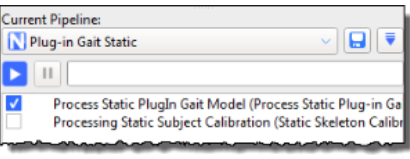

5. 检查模型已经被正确处理
- 确认运行的pipeline左侧有一个绿色的打勾标志
- 确认3D Perspective视图中Plugin Gait bones是可见的。如果不可及，按下F7，在Options对话框中勾选Plugin Gait Bones
- 在Subjects resources面板，确认在展开Model Outputs之后，能看见计算出来的各种变量（角度、力、质量等等）
6. **按下CTRL+S或者点击保存按钮以保存测试以及VSK。**

## （3） 纠正被错误互换的标记
如果没有进行过标记点的标记，那么校准过程不会成功。但是如果标记过程有错误，校准过程不会失败，但是会在之后的自动标记过程中持续产生错误的结果。
1. 在3D Perspective视图中或者System Resources面板选中两个被互换的点
2. 在Label/Edit Tools面板，在Manuel Labeling 区，点击Swap Marker Labels
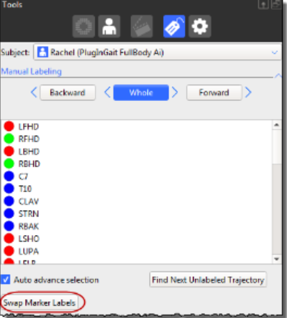

## (4) 手动标记一段数据
1. 在Communications面板，Data Management栏，打开包含已重构的标记点的数据
2. 拖动时间指针，选择一帧处于静止状态的数据
3. 在System Resources树中，确认只有你从模板创建的subject是能够用于捕捉的（能用于捕捉的subject左边的框内有一个打勾标志）
4. 在Label/Edit Tools面板，从Subject列表中选中要手动标记的subject
5. 默认情况下，Whole按钮被选中，这种情况下，当你在当前帧标记好一个点，这个点在之前和之后的所有帧都会被标记。如果你不想这样，你也可以选中Backward或者Forward。
6. 在Manuel Labeling区中，勾选Auto advance selection，这样Nexus会帮你选择下一个要标记的点
7. 在Manuel Labeling区中的列表里点击你要标记的点，然后在3D perspective 视图里选中与之相应的点，这样，一个点就被成功标记了。如果你要取消标记一个点，只要再次在Manuel Labeling 区中点击一下这个点就行了。重复该步骤，直到所有的点都被标记好。
8. 检查标记是否正确。

# 三、进行运动捕捉与处理
## 进行运动捕捉
完成了之前的步骤之后，你就可以开始捕捉所需的实验数据了。
1. Go Live
2. 选择3D Perspective视图
3. 在Capture Tools面板，从Trial Type列表中选择一个已有的运动捕捉的配置
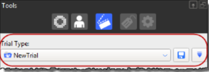
4. 在Next Trial Setup 区，填写存储数据的细节。在Data Source Setup中，确认Optical Camera Data, Video Camera Data, 以及Device Data是根据你的要求选择的。(Device Data是指测立板、表面肌电等数据)
5. 如果想要自动开始、停止捕捉，在Auto Capture Setup中进行相应设置。
6. 在Post-Capture Pipeline Setup中，你可以指定在捕捉完成之后自动进行的流程（如果你使用的是PiG模型，你可以选中Run pipeline after capture然后选择Recoustruct And Label以及Plug-in Gait Dynamic）。
7. 在System Resources树中，选中Local Vicon System，在它的Properties面板中，General区中，将Processing Output Level 设置为Level
8. 如果没有设置自动开始捕捉的话，在Capture区内手动点击Start。
9. 让受试者进行要捕捉的运动
10. 如果没有设置自动停止捕捉的话，在Capture区内手动点击Stop。

**现在你可以重构并标记你的数据了。这个步骤可以通过下面描述的那样手动进行，也可以向在第6步里面那样自动进行。**

## 重构并标记运动数据
1. 选择以下两种方法中的一种：
    - 如果你刚刚完成数据的捕捉，确认原始数据在Camera视图里仍然可见，确认Nexus处于offline或者pause状态
    - 在Data Management栏中，打开数据
2. 根据你是否需要调整重构和标记的设置，选择以下途径：
    - 不改变设置，点击Reconstruct and Label
    - 需要改变设置，在Pipeline Tools面板，从Current Pipeline列表，选中Reconstruct and Label。点击Combined Processing，设置Pricessing Output Level为想要的级别，如Labels，然后设置其他需要的设置。
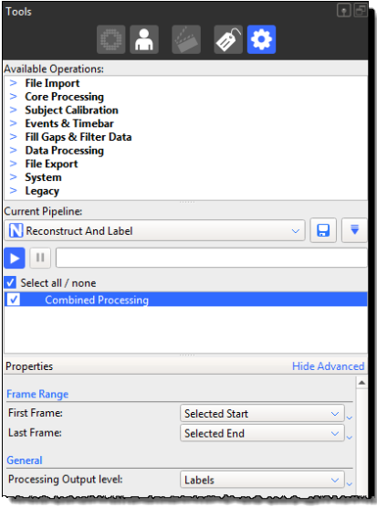

现在你可以进行数据的评估以及填补空缺。

# 数据评估和空缺填补
## （1）数据评估
略
## （2）空缺填补
当Nexus重构subject上的标记点时，理想状况下它会生成一条光滑的运动轨迹。但是，由于各种现实原因（有遮挡），有时生成的轨迹是有空缺的、不连贯的，这时需要我们填补空缺。
### 自动进行空缺填补
1. Go offline, 选择3D Perspectibe视图
2. 在Subjects树中，选中正确的subject。在Label/Edit Tools面板中，Gap filling 区中，所有存在空缺轨迹的标记点都被列在Trajectory中。
3. 在工具条中，点击Auto Gap Fill
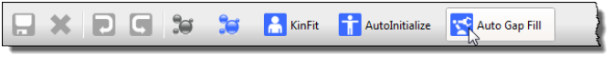
### 手动进行空缺填补
使用Label/Edit Tools面板进行手动填补。
1. Go offline, 选择3D Perspectibe视图
2. 在Subjects树中，选中正确的subject。在Label/Edit Tools面板中，Gap filling 区中，所有存在空缺轨迹的标记点都被列在Trajectory中。
3. 在Trajectory中，选中你想要填补轨迹的标记点。Nexus自动将当前时间帧设置为空缺段的中间，并且在轨迹上用箭头标出了空缺段的起始点。
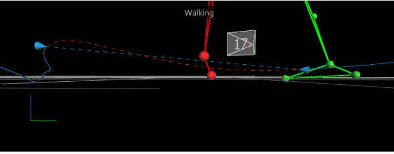
4. 在Range区内，通过Prev Gap, Next Gap按钮切换空缺帧
5. 选择合适的填补方式生成数据、填补空缺，填补方法包括：
    - spline fill
    - pattern fill
    - rigid body fill
    - kinematic fill
    - cyclic fill
6. 在选中的填充区域内：
    - 点击Fill, Nexus只会填补当前选中的空缺
    - 点击All，Nexus会填补选中轨迹所有的空缺
7. 重复3-6，直到所有空缺都被填补完整

至此，一个完整的运动捕捉流程已经完成，你可以开始导出数据了。

# 导出数据
## 导出ASCII数据
*Export ASCII* 流程帮助我们导出数据到文本文件里，例如csv或者txt格式
1. 确认已经加载并处理好了数据
2. 在Pipeline Tools面板，创建一个包括了Export ASCII的 File Export 流程（新建流程后点击Export ASCII，然后保存即可）。
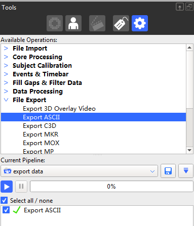
3. 在Current Pipeline操作列表中，点击export ASCII操作，然后在Properties区内，根据需要改变一下设置
    - Filename
    - File extensions（建议采用csv）
    - Delimiter
4. 运行

至此，一个完整的流程已经结束，你可以在数据库中找到你的输出数据并进行分析了。