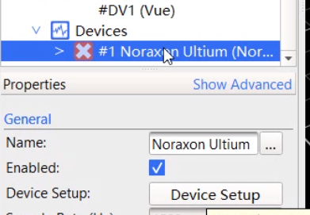
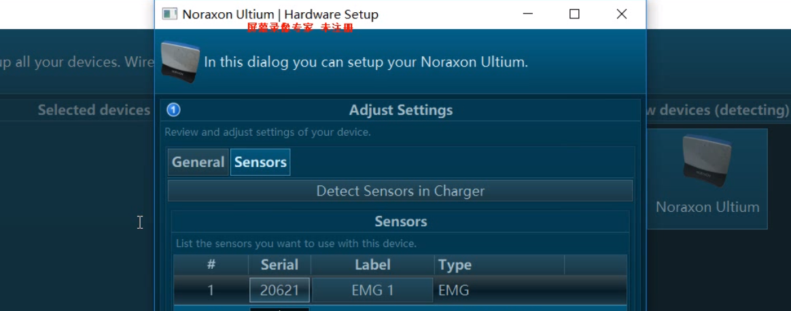
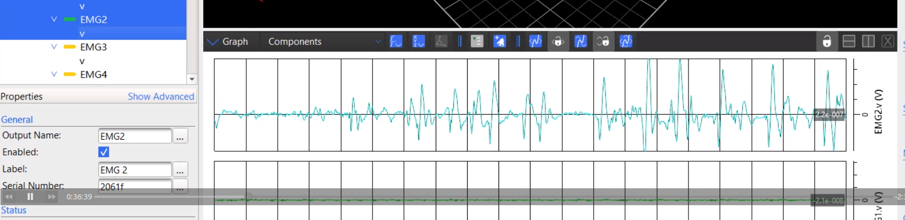
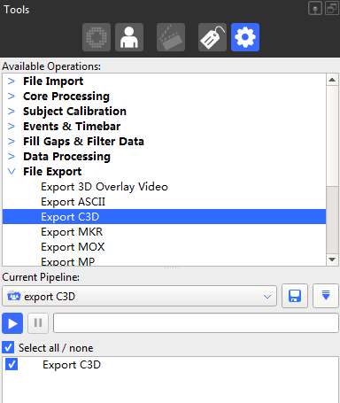

## 本教程描述了如何在Nexus软件里，在捕捉运动数据的同时进行肌电信号的捕捉与记录
1. 打开Nexus软件（插件已经被管理员安装好，无需理会）
2. Go Live
3. 在System Resources页下找到Device，点击左侧 ">"标志，点击选中Noraxon Ultium，然后点击Device Setup.

    
1. Nexus弹出一个界面（和在MR3软件中一样的界面），在这个界面中进行配置，添加传感器。（详情见肌电信号部分教程）

5. 配置完成后，就可以进行肌电信号数据的采集了。依次展开以下列表：System->Devices->#1Noraxon Ultium，选中所有你在第4步中添加的传感器。
6. 选择Graph视图，此时会实时出现所有信号。

7. 进行信号的捕捉记录（在这之前要确认已经为该次实验创建了数据库）：这一步与动作捕捉中的捕捉是一样的。
8. 导出c3d文件
    - 确认已经加载并处理好了数据
    - 在Pipeline Tools面板，选择已有的export C3D流程，或者创建新的包括了Export C3D操作的 export C3D 流程（新建流程后点击Export C3D，然后保存即可）。
   
    - 在Current Pipeline操作列表中，点击export C3D操作，然后在Properties区内，根据需要改变一下设置
       - Filename
       - File extensions（建议采用csv）
       - Delimiter
    - 运行
9. 现在可以在MR3软件中导入这个c3d文件进行数据分析（Nexus无法进行肌电信号的数据处理）。
