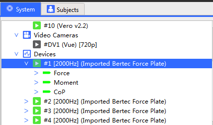
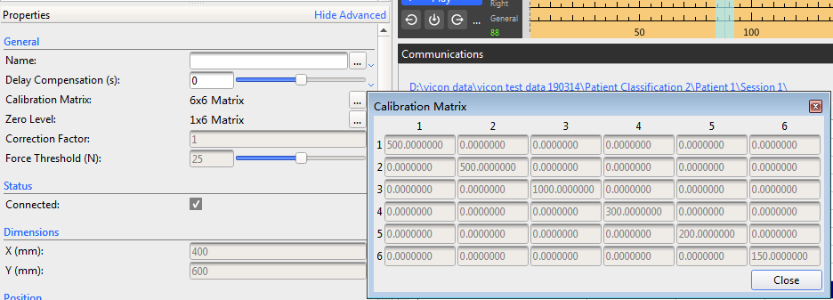
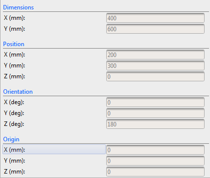

## 以下部分说明了如何在Nexus中配置测力板
1. 进行硬件的连接
2. Go Live
3. 在System 列表下展开Devices列表，选中第一个*Imported Bertec Force Plate*

    
    
4. 在它的Properties页点击Calibration Matrix右方的"..."符号，在弹出的框内填写好标定参数（标定参数如图所示，每块测力板都是一样的）并保存。（我截图时用的是之前记录的数据所有不能修改，呈现灰色）
    
5. 修改其他参数：
    - Dimensions 是指长宽
    - Positions：世界坐标
    - Orientations：各个轴旋转的角度。其中Z最容易弄错，纠正方法如下：用力踩踏测力板的一个角落，观察3D Perspective视图里的力线是否在正确的位置，如果不在，调整之。
    
6. 依次修改剩下的所有测力板。
7. 现在可以正常地开始进行运动捕捉(如同没有测力板时一样捕捉，最后导出数据时测力板的数据也会被导出到同一个文件内，注意测力板的采样频率是相机10倍，所以在文件的开始一大段数据都是测力板的数据)