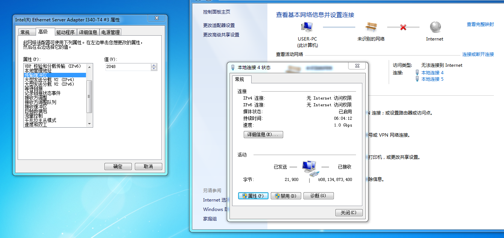
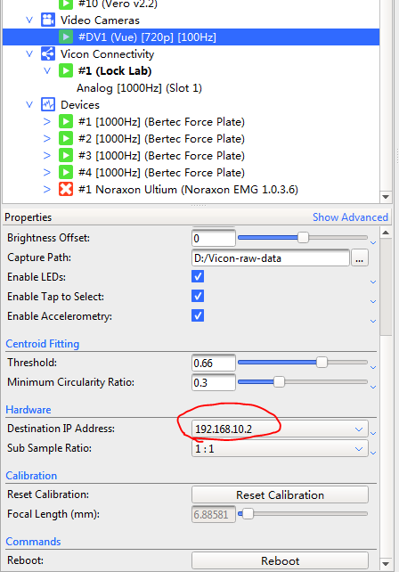
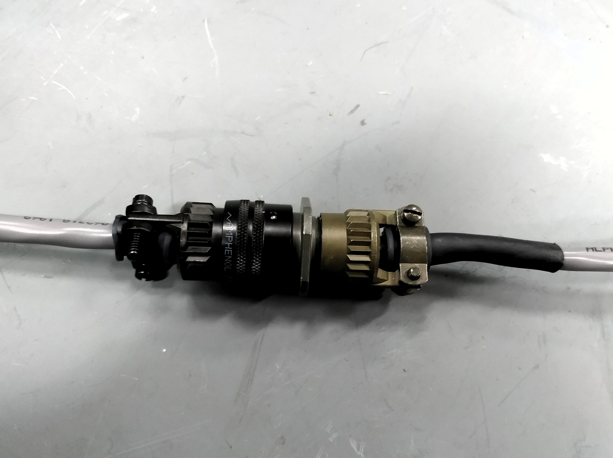
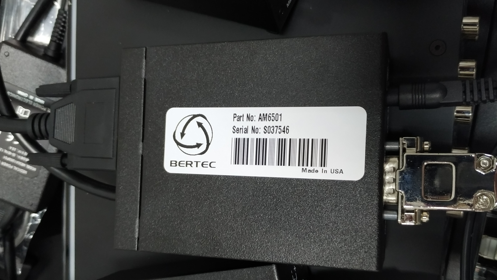
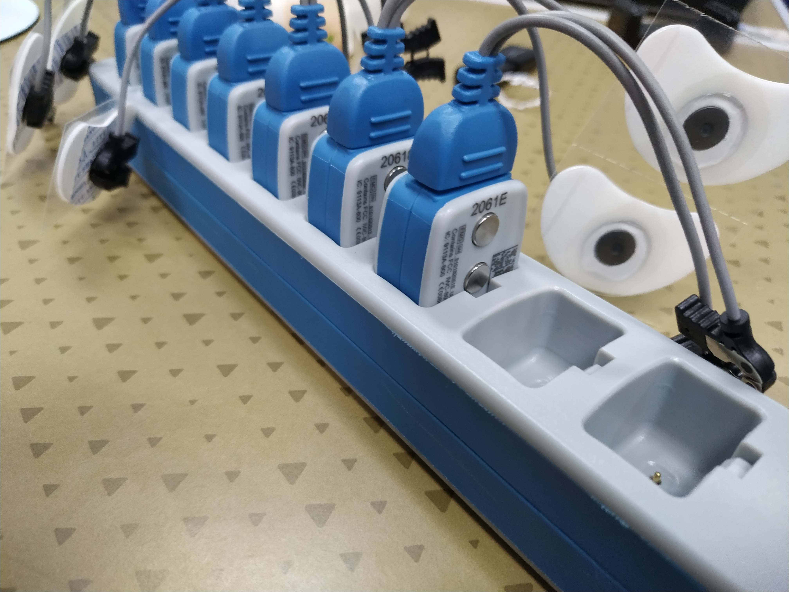

# 1. 摄像头的连接
-  摄像头由网线连接到交换机，在交换机上每4个网口接3个，空出一个不接，接的顺序没有要求。网线带有整流器（黑色小块）的一端靠近摄像头连接。
- 交换机到电脑的连接：两根网线分别连接至电脑专配网卡的四个网口中的两个（保证数据传输速率，电脑自带网卡不行）。
- 交换机到Lock Lab：由一根网线连接
- 在电脑上进行配置：
    
    1. 在控制面板中进入网络控制中心，选择并双击之前交换机与电脑的本地连接中的一个，依次进入“属性”->配置->高级。如图所示：
    2. 设置接受缓冲区为最大值（2048字节）
    3. 设置传输缓冲区为最大值（2048字节）
    4. 设置巨帧数据包为最大值（9014字节）
    5. 返回本地连接的属性表，选择并双击ipv4
    6. 设置IP地址为手动指定:192.168.10.1，掩码为255.255.255.0
    7. 保存退出，选择本地连接中的另一个，并重复2-6步，但是在设置IP地址时指定为192.168.10.2（这个是彩色摄像头的地址）
    8. (如果由两个彩色摄像头，则就会有三个本地连接，以此类推)
    9. 在软件中设置彩色摄像头：在Nexus中打开Video Cameras,选中某个摄像头，在Hardware-> Destination IP Address中，设置为192.168.10.2（.1 是所有红外摄像头的网口，.2以及以后是彩色摄像头），如图：
    

# 2. 测力板的连接
## - 按照图示进行连接：

## 左侧接入下方图示中，右侧是测立板的引出线。

## 左侧接入Lock Lab.

# 3. Noraxon的连接（表面肌电信号分析装置）
- 需要注意的地方：
    1. 为信号收发器充电时：有三个金属原点的面朝向充电装置有缺口的一面，否则无法充电且会损坏设备。如图：
    